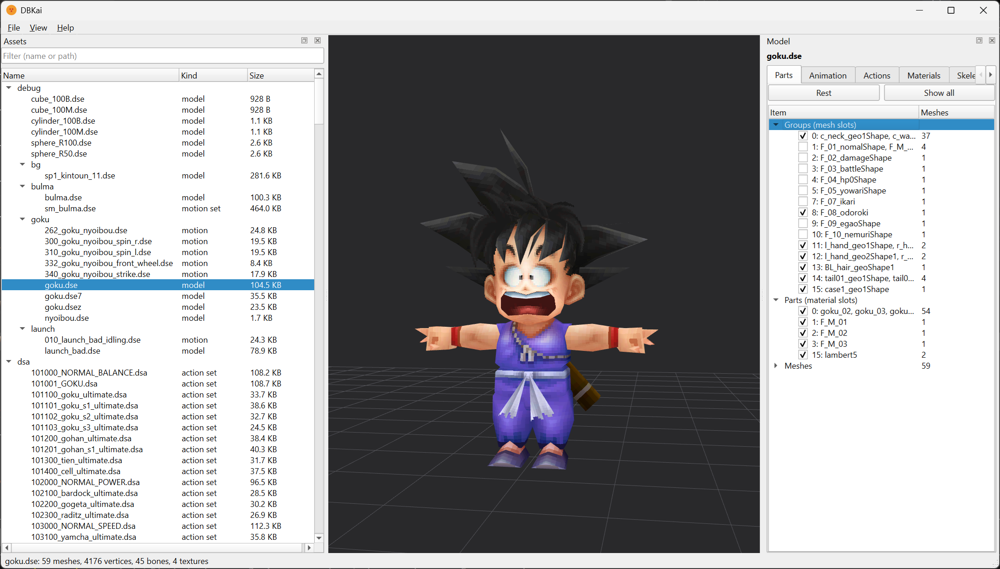
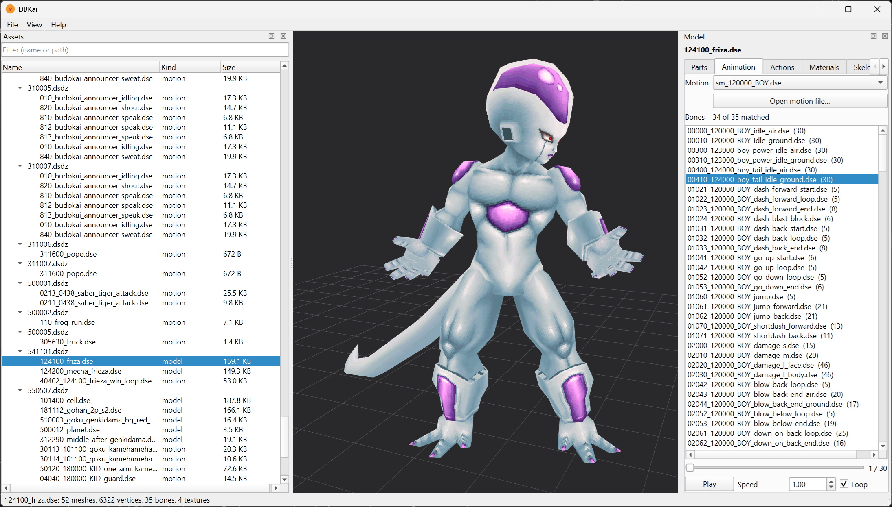
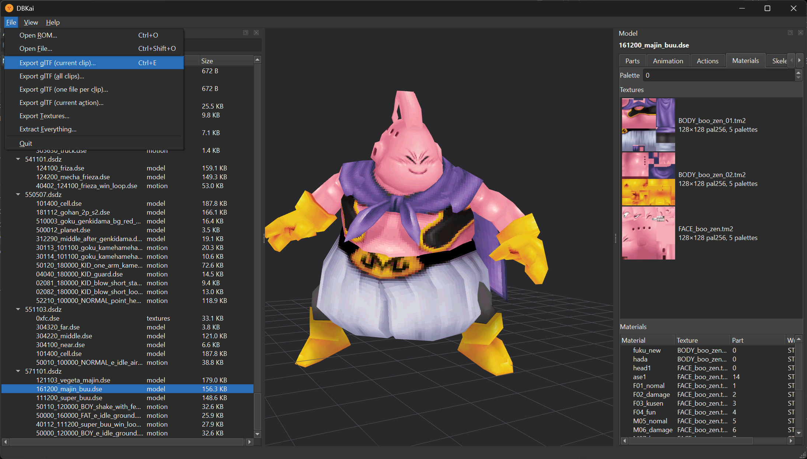
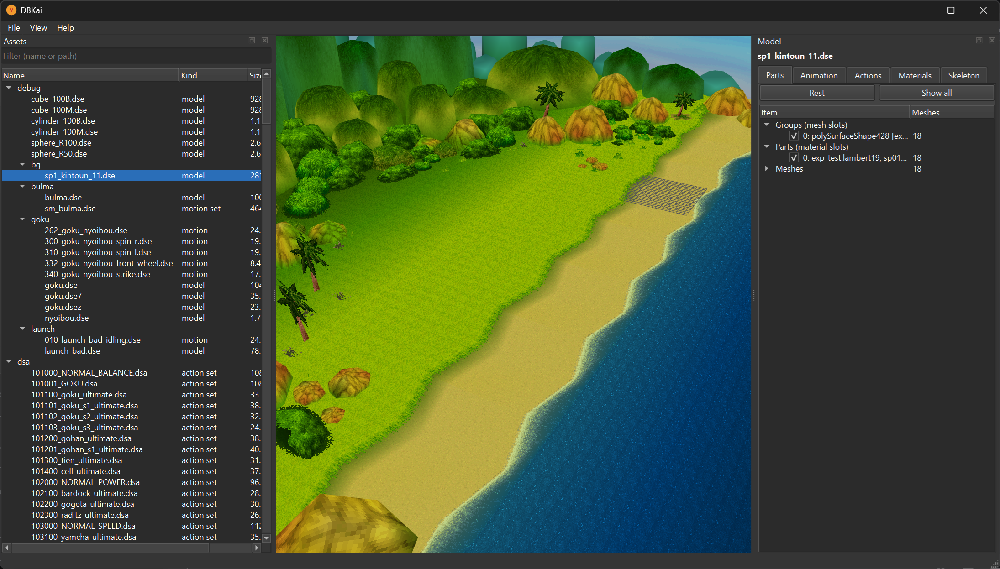

# DBKai

**DBKai** is a model viewer and extractor for **Dragon Ball Kai: Ultimate
Butoden** (Nintendo DS). It opens your own copy of the ROM, shows the game's 3D
models with their textures, parts and animations, and exports them to glTF 2.0.

DBKai is built on Python + Qt (PySide6) and runs on Windows, macOS and Linux.

  
  
   
  
  

## Features

- **Asset browser** - every model in the ROM, including the ones embedded in
  story packages, as a filterable tree.
- **Viewport** - OpenGL rendering with the game's culling and transparency
  rules, posed and animated by the model's motion set, with a grid and bone
  overlay.
- **Parts** - switch the faces, hands and costume pieces the game layers on one
  model.
- **Animation** - pick a clip, then scrub through it or play it.
- **Actions** - play the game's own moves: each action from the character's
  action sets runs its motion clips and switches parts (fists, damage face)
  on the frames the game does.
- **Materials & skeleton** - texture previews with palette choice, and the bone
  hierarchy.
- **Export** - glTF 2.0 with skeleton, textures and animation clips: the current
  clip, all clips in one file, or one file per clip. Textures export as PNG, and
  Extract Everything writes out the whole ROM at once.

## Thank You

Thanks to the following projects, which made working out the game's formats
possible:

- **[melonDS](https://github.com/melonDS-emu/melonDS)**
- **[ds-decomp](https://github.com/AetiasHax/ds-decomp)**

## AI Use Disclaimer

This tool was created with the help of an AI coding agent. All of the code is AI
generated, but the design and other aspects of this project are my own.
